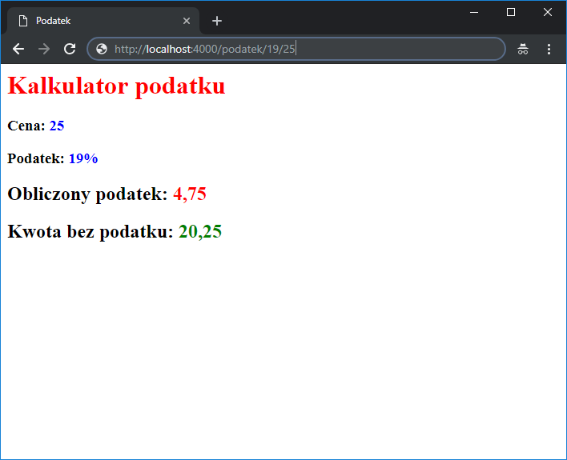

# Node.js - Laboratorium 6

## templates (https://expressjs.com/en/guide/using-template-engines.html)

### `application with Pug`
```javascript
// npm install pug

const express = require('express');
const app = express();

app.set('view engine', 'pug');
app.set('views', './views');

app.get('/', function (req, res) {
    const scope = { header: 'heloo!', paragraphText: 'some paragraph text' };
    res.render('index', scope);
});

app.listen(4000, () => console.log('start server'));
```
### `template pug(views/index.pug)` (https://pugjs.org/api/getting-started.html)
```pug
html
    body
        h1= header
        p= paragraphText
```

### `application with mustache.js`
```javascript
// npm install mustache
// npm install mustache-express

const express = require('express');
const mustacheExpress = require('mustache-express');
const app = express();

app.engine('mustache', mustacheExpress());
app.set('view engine', 'mustache');
app.set('views', './views');

app.get('/', function (req, res) {
    const scope = { header: 'heloo!', paragraphText: 'some paragraph text' };
    res.render('index', scope);
});

app.listen(4000, () => console.log('start server'));
```
### `template mustache(views/index.mustache)` (https://mustache.github.io/mustache.5.html)
```mustache
<html>
    <head>
        <title></title>
    </head>
    <body>
        <h1>{{ header }}</h1>
        <p>{{ paragraphText }}</p>
    </body>
</html>
```

## mongoose (https://mongoosejs.com/)
```javascript
const mongoose = require('mongoose');
mongoose.connect('mongodb://localhost:27017/test', { useNewUrlParser: true });

const Cat = mongoose.model('Cat', { name: String });

const kitty = new Cat({ name: 'Zildjian' });
kitty.save().then(() => console.log('meow'));
```

## Zadania do wykonania na laboratorium

1. Stwórzmy nasz pierwszą aplikację serwerową wykorzystującą system szablonów `PUG`. Obsłużmy ścieżki takie jak:
```
'/' - wyświetli przywitanie 'hello world!' jako nagłówek ('h1')
'/Jan' - wyświetli przywitanie 'hello Jan!' jako nagłówek ('h1')
'/Adam' - wyświetli przywitanie 'hello Adam!' jako nagłówek ('h1')
...
```

2. Przećwiczmy wczytywanie szablonów zmieniając system szablonów `PUG` na `MUSTACHE`(https://github.com/bryanburgers/node-mustache-express). Stwórzmy aplikację, która wyliczy nam podatek z podanej kwoty i zwróci nam widok z danymi.

Przykład ścieżki `/podatek/19/25`, gdzie `19` to wysokość vat podana w procentach oraz `25` kwota.

Przykład widoku:



3. Wykorzystując bazę danych MongoDB, stwórzmy aplikację typu lista zadań (`todo list`), zamiast wcześniej użytego zwykłego klienta `mongodb` wykorzystajmy bibliotekę `mongoose` 

- aplikacja powinna pozwalać na dodanie nowego dokumentu do naszej bazy w postaci:
```JSON
{
	"task": "Kupić lody",
	"completed": false
}
```
- pozwolić na zmodyfikowanie opisu jak również i określić iż dane zadanie zostało wykonane
- usunąć wpis z listy
